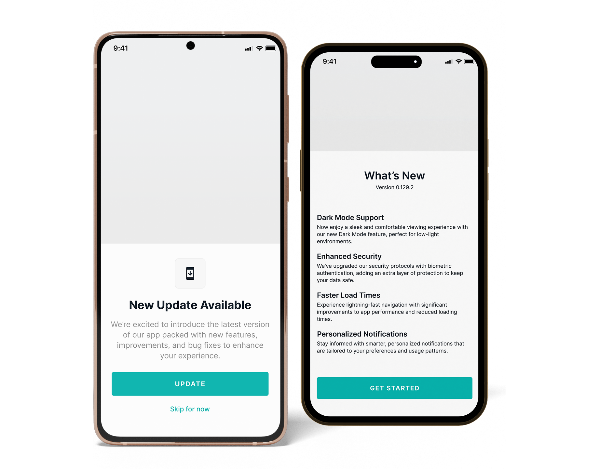
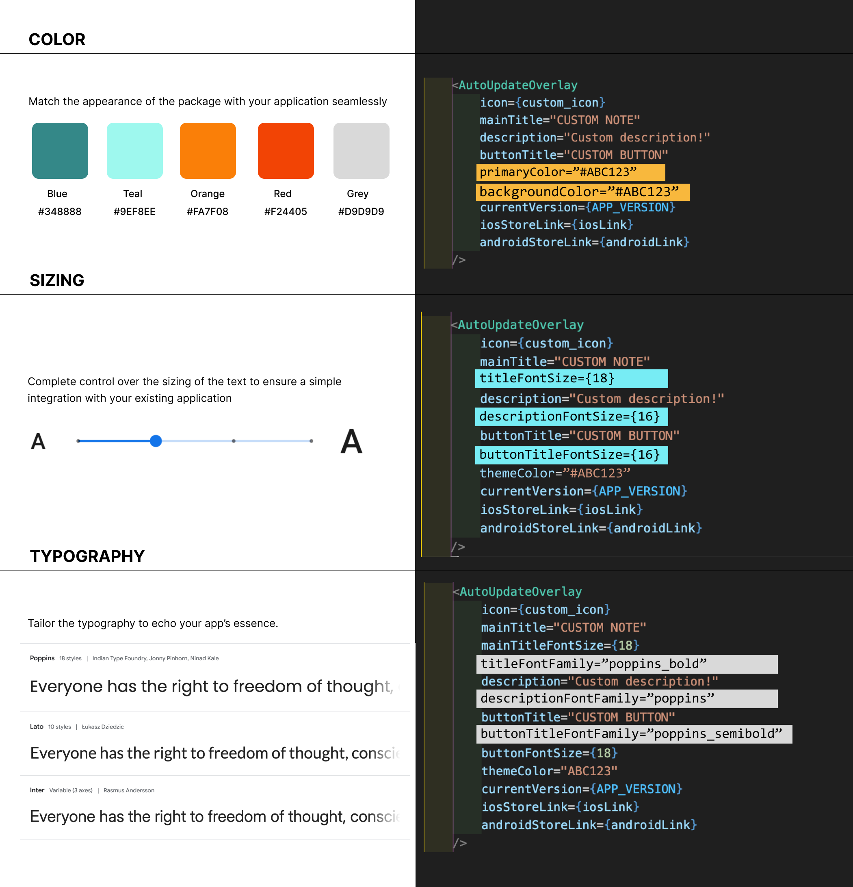

# React Native Update Helper

<!-- [![Version][version-badge]][package] -->


[![MIT License][license-badge]][license]
[](https://www.npmjs.com/package/react-native-update-helper)

A customizable package designed to efficiently manage app update notifications across iOS and Android platforms. It automates app version fetching from PlayStore/AppStore to prompt users for optional and mandatory updates. Plus, you can add an optional "What's New" overlay to keep users informed about the latest features and changes.



## Motivation

🚀 Getting users to updated apps across multiple platforms can be tricky. That’s why we built React Native Update Helper package.

Our goal is simple: **happy users, happy developers**!

Inspired by the need for a seamless, cross-platform solution, this package helps you manage updates effortlessly while keeping everyone in the loop with the latest features and improvements.

## Key Features

**🎯 Auto Update Overlay**

- **Instant Results**: Just provide the PlayStore/AppStore links and current version, and the package will automatically fetch the latest version and prompt users to update when needed.

**🛠️ Go Manual**

- **Full Control**: Take charge of the update overlay logic, so you decide exactly when and how users are prompted to update.

**🔍 What's New**

- **Feature Highlights**: Easily showcase the latest features, improvements, and bug fixes with a dedicated "What's New" section.

**📱 Platform Support**

- **iOS & Android**: Ensure a consistent and smooth update experience across all devices.

**🚀 Easy Setup**

- **Get Started Quickly**: Simple installation and setup instructions to have you up and running in no time.
- **Smooth Integration**: Seamlessly integrate with your existing React Native app.

**🎨 Highly Customizable**

- **Branding**: Tailor the overlays to match your app's look and feel.
- **Flexibility**: Adjust colors, fonts, and layout to suit your style.



## Installation

Install the package.

```sh
npm install react-native-update-helper
```

Install the dependences.

```sh
npm i @react-native-async-storage/async-storage
```

Requires **React Native 0.60+**

Remember to install the pod with:

```sh
npm pod install
```

✨ Note: The package supports only [semantic](https://semver.org/) type of versioning.

## Usage

Begin by importing the package into your screen to start using it.

```sh
import {AutoUpdateOverlay, ManualUpdateOverlay} from 'react-native-update-helper';
```

### Automated Update

**Start with the simplest setup**: this configuration provides automated logic for running the update overlay with a clean, default style.

```sh
 <AutoUpdateOverlay
    currentVersion={APP_VERSION}
    iosStoreLink={iosLink}
    androidStoreLink={androidLink}
/>
```

**Add Your Flavor**: Customize your overlay by tweaking the main title, description, colors, button title, and icon to perfectly match your app’s style.

```sh
 <AutoUpdateOverlay
    icon={custom_icon}
    mainTitle="CUSTOM NOTE"
    description="Custom description!"
    buttonTitle="CUSTOM BUTTON"
    primaryColor="#ABC123"
    backgroundColor="#EEE777"
    titleFontFamily="Mulish-Bold"
    descriptionFontFamily="Mulish-Regular"
    buttonTitleFontFamily="Mulish-SemiBold"
    titleFontSize={18}
    descriptionFontSize={14}
    buttonTitleFontSize={16}
    currentVersion={APP_VERSION}
    iosStoreLink={iosLink}
    androidStoreLink={androidLink}
/>
```

**What's New Section**: Choose whether to display the "What's New" section and personalize its content to fit your app’s updates.

✨ Note: If you don’t provide a custom description, it will be automatically pulled from the store’s "What's New" section.

```sh
 <AutoUpdateOverlay
    currentVersion={APP_VERSION}
    iosStoreLink={iosLink}
    androidStoreLink={androidLink}
    isWhatsNewRequired //true by default
    whatsNewDescription={'We have updated Our App!'}
/>
```

### Manual Update

For complete control over the update process, switch to the **Manual Update Overlay** and manage the setup yourself.

```sh
 <ManualUpdateOverlay
    updateAvailable={true}
    isMandatoryUpdate={true}
    onDismissButtonPress={() => dismissUpdateOverlay(false)}
    iosStoreLink={iosLink}
    androidStoreLink={androidLink}
  />
```

**Add Your Flavor**: Customize your overlay by tweaking the main title, description, colors, button title, and icon to perfectly match your app’s vibe.

```sh
 <ManualUpdateOverlay
    icon={custom_icon}
    mainTitle="CUSTOM NOTE"
    description="Custom description!"
    buttonTitle="CUSTOM BUTTON"
    primaryColor="#ABC123"
    backgroundColor="#EEE777"
    titleFontFamily="Mulish-Bold"
    descriptionFontFamily="Mulish-Regular"
    buttonTitleFontFamily="Mulish-SemiBold"
    titleFontSize={18}
    descriptionFontSize={14}
    buttonTitleFontSize={16}
    updateAvailable={true}
    isMandatoryUpdate={true}
    onDismissButtonPress={() => dismissUpdateOverlay(false)}
    iosStoreLink={iosLink}
    androidStoreLink={androidLink}
  />
```

**What's New Section**: Choose whether to display the "What's New" section and personalize its content to fit your app’s updates.

✨ Note: To automatically fetch the description from the store’s "What's New" section, make sure to provide the current version. If not, you can manually set the content yourself.

```sh
 <ManualUpdateOverlay
    updateAvailable={true}
    isMandatoryUpdate={true}
    onDismissButtonPress={() => dismissUpdateOverlay(false)}
    isWhatsNewRequired //true by default
    whatsNewDescription={'We have updated Our App!'} // not required if fetching content automatically
    currentVersion={APP_VERSION} //required if isWhatsNewRequired is set to true
    iosStoreLink={iosLink}
    androidStoreLink={androidLink}
  />
```

## Properties

### Common properties (optional)

| Prop                        | Description                                                                                 | Type      |
| --------------------------- | ------------------------------------------------------------------------------------------- | --------- |
| **`icon`**                  | Top icon.                                                                                   | _Image_   |
| **`mainTitle`**             | Main overlay title.                                                                         | _String_  |
| **`description`**           | Main overlay description.                                                                   | _String_  |
| **`buttonTitle`**           | Allows to customize the 'Update' button title.                                              | _String_  |
| **`isWhatsNewRequired`**    | Indicates whether the What's New section is shown.                                          | _Boolean_ |
| **`whatsNewDescription`**   | Sets custom content for the What's New section (overwrites automated fetch of the content). | _String_  |
| **`primaryColor`**          | Sets custom background color for the buttons.                                               | _String_  |
| **`backgroundColor`**       | Sets custom background color.                                                               | _String_  |
| **`titleFontFamily`**       | Sets custom font family for the main title.                                                 | _String_  |
| **`descriptionFontFamily`** | Sets custom font family for the description.                                                | _String_  |
| **`buttonTitleFontFamily`** | Sets custom font family for the button titles.                                              | _String_  |
| **`titleFontSize`**         | Sets custom font size for the main title.                                                   | _Number_  |
| **`descriptionFontSize`**   | Sets custom font size for the description.                                                  | _Number_  |
| **`buttonTitleFontSize`**   | Sets custom font size for the button titles.                                                | _Number_  |

### Automated version update properties (required)

| Prop                   | Description                                                              | Type     |
| ---------------------- | ------------------------------------------------------------------------ | -------- |
| **`currentVersion`**   | Requires the application's current version.                              | _String_ |
| **`iosStoreLink`**     | Requires a link to the currently published application in the App Store. | _String_ |
| **`androidStoreLink`** | Requires a link to the currently published application in Google Play.   | _String_ |

### Manual version update properties

| Prop                       | Description                                                                                                            | Type       |
| -------------------------- | ---------------------------------------------------------------------------------------------------------------------- | ---------- |
| **`updateAvailable`**      | Indicates whether the overlay should be shown or hidden. **Required**                                                  | _Boolean_  |
| **`isMandatoryUpdate`**    | Defines whether the update is mandatory or non-mandatory. **Required**                                                 | _Boolean_  |
| **`whatsNewDescription`**  | Manually ets the content for what is new in the update. **Available only if isWhatsNewRequired = true.**               | _String_   |
| **`onDismissButtonPress`** | Dismisses the overlay. **Required**                                                                                    | _Function_ |
| **`currentVersion`**       | Requires the application's current version. **Required only if isWhatsNewRequired = true and fetching automatically.** | _String_   |
| **`iosStoreLink`**         | Requires a link to the currently published application in the App Store. **Required**                                  | _String_   |
| **`androidStoreLink`**     | Requires a link to the currently published application in Google Play. **Required**                                    | _String_   |

## License

This project is licensed under the MIT License - see the [LICENSE](LICENSE) file for details.

<!-- badges -->

[license-badge]: https://img.shields.io/badge/license-MIT-green.svg
[license]: https://opensource.org/licenses/MIT
